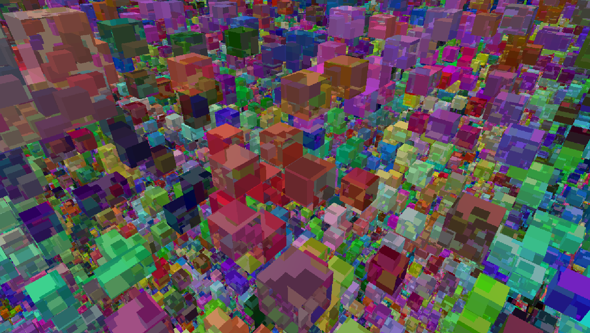

## Overview
**Date :** June 2023  
**Languages :** HLSL, C#  
**Libraries :**  Unity Compute Shaders  
**IDE :**  Unity Game Engine  
**Purpose :**  Hobby/Learning  
**Learning Sources :**  Sebastian Lague's Raytracing, Voxelbee Devlogs, DDA Algorithm  
**Time Spent :** ~14 days  

## Summary
This project is a C++ application which renders a static grid of voxels using the OpenGL rendering pipeline. During testing, I have managed to render 32,768,000 voxels at a crisp framerate. To achieve this, multiple optimizations have been made. Each voxel is stored as a 16-bit short, enumerated as a "Block", and held within a "Chunk" under a "World". These abstractions allow modular memory management and a wide range of possible scene sizes. By iterating over every block and comparing neighbors, we can generate a mesh of triangles for every visible surface in the scene. Additional calculation is done to determine where shadows should be placed in between edges (voxel-space ambient occlusion) and to determine light levels. This mesh data is bitpacked and sent to a shader that parses bitwise position and lighting data, then applies a texture using that information. Additional matrix math (via GLM) is done to create a player camera that can explore the scene. This is all converted into OpenGL-compatible buffer objects and rasterized on a GLFW window.

## Takeaways
- C++ memory management requires extremely careful deconstruction, abstraction, and standard library wrappers  
- Templates are a tempting tool but ultimately make code hard to predict  
- Building my own variable types can reduce bloat immensely in high-level functions  
- OpenGL's reputation as an aging framework is due to frustrating boilerplate and egregious debugging tools  
- File organization is key because of the surplus header files generated in C++  
- Macros can be a powerful experimentation tool, but need to be used sparingly  

## Video Montage

Warning - Video contains multiple instances of flashing colors

▶️ [Youtube Link](https://www.youtube.com/watch?v=kP7laC2ohEo)

## Diagram

The full size diagram is available as a PDF or PNG in the "Screenshots" folder  


## Screenshots
<p>Here you can see a scene of 3d Perlin noise used to create sweeping curves.</p>


---
At this angle, you can see the extreme scale of the grid being rendered. This is real-time.


---
In this block layout, you can see how the ambient occlusion works even in tight spaces.
The shadows are exaggerated for effect in this demonstration.


---
Shaders allow rapid iteration of effects on color or warped terrain. In this scene, colors are rapidly
washing over every block in a looping sine rainbow pattern.


---
Another effect utilized is UV rotation. In mesh generation, each block face is given a random
rotation to break up repeating textures, visible in all these screenshots. This is especially helpful 
because there is no anti-aliasing for distant textures.


---
Up close, you can see the edges of cubes are crisp. Near-parallel faces are still rendered in full color,
giving an intense experience of perspective and immersion.


---
Because I am using back-face culling for triangles, going inside of solid terrain creates an interesting x-ray visual effect.


---
This x-ray effect is even more visible when near the bounds of the world. Here, you can see the cave shapes generated by Perlin noise.



## Code Highlights

Vertex Shader (PerspectiveBinaryMem.shader):

```hlsl
void main() {
    // Determine 3d coordinate of this vertex with first 15 bits
    // 5 bits per axis allows 2^5 = 32 possible values. Each chunk is size 31x31x31 to fit within this range.
    // This downsizing is necessary since edge vertices will project their vertex coordinates 1 above the max bound (32 here)
    float x = float((binVertex & 0x1Fu) >> 0u);
    float y = float((binVertex & 0x3E0u) >> 5u);
    float z = float((binVertex & 0x7C00u) >> 10u);

    // Convert the vertex coordinate from model/chunk/local space to world space
    x += u_ChunkPos.x;
    y += u_ChunkPos.y;
    z += u_ChunkPos.z;

    // Collate a coordinate value and multiply by Model-View-Project matrix to generate screen position
    // This is passed to the fragment shader for scanline rendering
    vec4 worldPos = vec4(x, y, z, 1.0);
    gl_Position = u_MVP * worldPos;

    // Parse additional bit flags from the following layout:
    // 3-10-2-5-5-5
    // LightValue-TextureID-BlockID-z-y-x
    uint uvID = (binVertex >> 15u) & 3;
    uint textureID = (binVertex >> 17u) & 1023;
    uint lightValue = ((binVertex >> 27u) & 7);
    float lightValueF = float(lightValue) / 7;

    // Pass final calculations into the fragment shader
    v_TexCoord = texCoords[uvID];
    v_lightValue = lightValueF;
}
```

Meshing Algorithm (ChunkMesher.cpp):
```hlsl
// Iterate over each face of this voxel
for (int side = 0; side < 6; side++) {
    // Project out with a normal vector and check if the neighbor voxel is solid or air
    checkPos = blockPos + sideNormals[side];

    // If the neighbor is opaque/non-air, do not draw a face. This face is occluded.
    if (GetBlockFreeform(mem, checkPos, chunk) != Block::AIR)
        continue;
    
    // All conditions are met so draw the side
    float* localVerts = sideVertices[side];
    
    // i represents vertex number
    for (int i = 0; i < 4; i++) {
        // Grab the vertex displacement based on which vertex we are assigning
        int3 vertLocalPos = int3(localVerts[i * 3], localVerts[i * 3 + 1], localVerts[i * 3 + 2]);
        int3 vertObjectPos = blockPos + vertLocalPos;
    
        // Ambient occlusion actually has a bias since quads are triangles, and will work differently
        // at different diagonals for every plane.
        unsigned int aoLevel = 0; //must be 0-2 since light is 2-7
        int3 aoOffset = ((vertLocalPos * 2) - 1);
        int3 aoCheckPos1 = checkPos + aoDirections[side][i][0];
        int3 aoCheckPos2 = checkPos + aoDirections[side][i][1];
        int3 aoCheckPos3 = checkPos + aoDirections[side][i][2];
    
        // Check aoCheckPos1 last since its the corner block, which has the weakest shadow
        // Having an effect of 1 for every case creates shadows of equal intensity for edges and corners
        if      (GetBlockFreeform(mem, aoCheckPos3, chunk) != Block::AIR)
            aoLevel = 1;
        else if (GetBlockFreeform(mem, aoCheckPos2, chunk) != Block::AIR)
            aoLevel = 1;
        else if (GetBlockFreeform(mem, aoCheckPos1, chunk) != Block::AIR)
            aoLevel = 1; //could be 1 for lighter corners

        // Determine block values that will need to be packed into this vertex
        int uvID = i;
        int blockID = (int)(blockType); // must be less than 1024
        int lightValue = sideLightValues[side] - aoLevel; //must be between 0-7. AO is 0-2

        // Bitpack all the information calculated so far. This will be parsed by the bitwise shader.
        // Packing this information reduces memory footprint from 32 * 7 = 224 bits down to 32 bits.
        // That is a video memory reduction of SEVEN times!
        //each position is 0-31   (32)   so we use 15 bits, 5 for each pos
        //the uv        is 0-3    (4)    so we use 2 bits
        //the blockID   is 0-1023 (1024) so we use 10 bits
        //the lightVal  is 0-7    (8)    so we use 3 bits
        //the total bitcount is 30	 bits
        GLuint compressedVertex = vertObjectPos.x | vertObjectPos.y << 5 | vertObjectPos.z << 10 | uvID << 15 | blockID << 17 | lightValue << 27;
        mesh.PushVertex(compressedVertex);
        
        // Debugging tool: print out binary data of any vertices of block 0, 0, 0
        //if (blockPos.x == 0 && blockPos.y == 0 && blockPos.z == 0) {
        //	std::cout << std::bitset<32>(compressedVertex) << std::endl;
    }

    // Push indices in an order that designates 2 clockwise triangles, composing a quad with 4 vertices
    unsigned int indexStart = (mesh.index_count / 6) * 4;
    mesh.PushIndices({
        indexStart,
        indexStart + 3,
        indexStart + 1,
        indexStart,
        indexStart + 2,
        indexStart + 3 });
}
```
