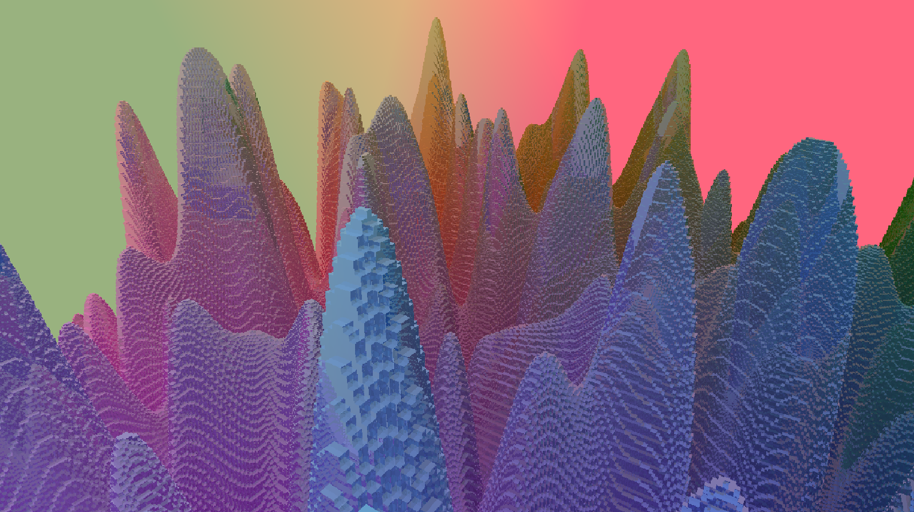
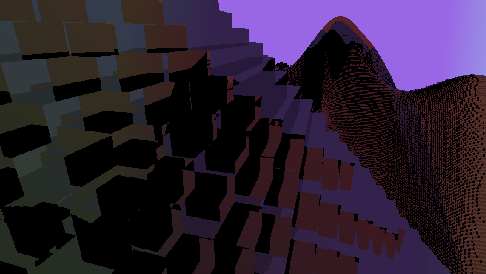
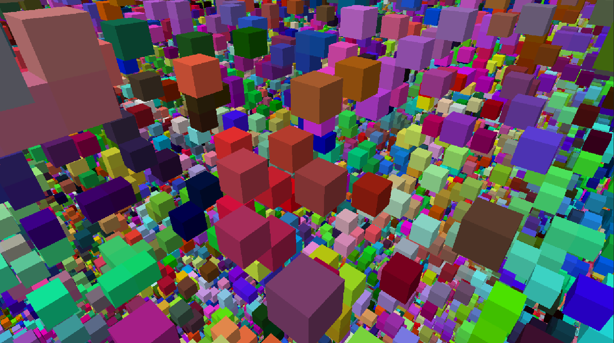
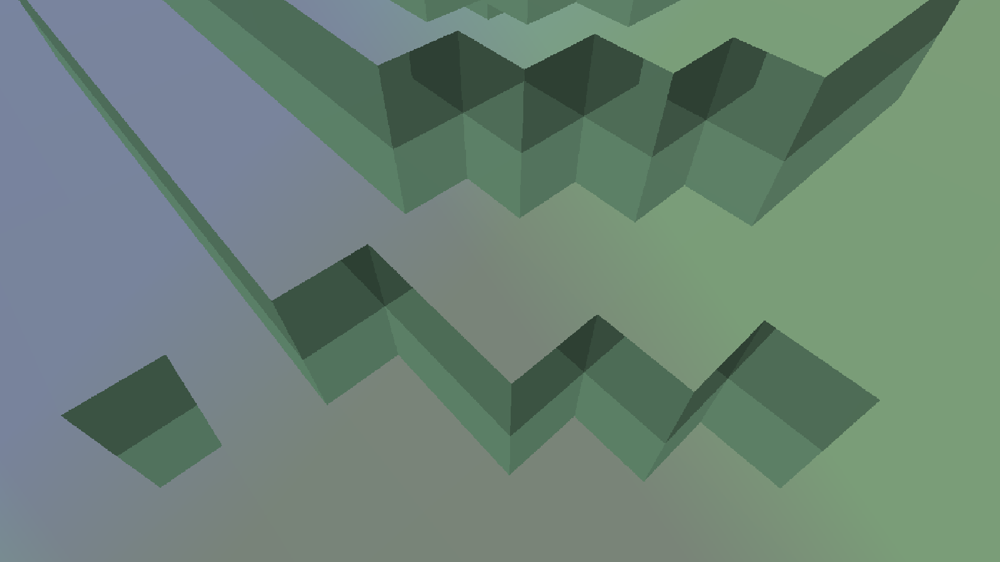

## Overview
**Date :** June 2023  
**Languages :** HLSL, C#  
**Libraries :**  Unity Compute Shaders  
**IDE :**  Unity Game Engine  
**Purpose :**  Hobby/Learning  
**Learning Sources :**  Sebastian Lague's Raytracing, Voxelbee Devlogs, DDA Algorithm  
**Time Spent :** ~14 days  

## Summary
This project is a voxel raymarcher with recursive reflections. It is written in HLSL and presented using the Unity game engine. To start, there is a Unity camera in the scene. Its transformation is modified with mouse and keyboard input using a C# script. A second script overwrites the camera's blit operation. Each time the screen is drawn, the user settings are updated (reflection count, world color, etc). A third script carries the voxels in memory 32-bit RGBA values, subdivided as chunks and copied into compute buffers. For demonstration purposes, there is a perlin noise function and a random-value setting when populating the voxel memory. All of the information in these scripts is passed into the shader as uniforms or buffers. The shader runs for each pixel of the screen, instantiating rays at the camera position. Perspective is applied to each ray based on the pixel's screen position. This simulates a camera frustrum. All rays are now calculated concurrently on the GPU. Each ray completes the following operations: 

1) Apply perspective using the screenspace UV coordinates associated with our pixel.
2) Geometrically calculate where this ray intersects with the global volume of chunks.
3) Step forward to the intersection with world bounds or return a mask if no intersection occurs.
4) Pass this valid ray position and direction into the Raymarch function.
5) The Raymarch function procedurally steps the ray position forward using the Digital Differential Analyzer algorithm (DDA).
6) Once a solid block (determined by the alpha channel) is hit, return the block's RGB value with a dot-product shadow applied.
7) The raymarch result is added to a running color sum. If reflections are off, the algorithm ends here with an opaque output.
8) If reflections are on and a hit was successful, the raymarch function is recursively called and its results are added to the color sum.
9) These recursive calls use the previous hit's data to instantiate a new ray at a reflected angle determined by the hit's normal.
10) The final color sum is applied to the corresponding screen-buffer pixel and returned for drawing.

The result is blazingly fast because the DDA algorithm is extremely efficient at traversing dense voxel space. DDA steps in block-wise space by hitting the next-closest axis, determined by the ray's direction. DDA only requires comparing the ratio between similar triangles. Once a block is hit, locating it in memory only takes O(n) time. This is because the block buffer is flattened into a 1d array. The buffer is organized by chunk strides in XYZ space, then their given blocks in XYZ space. This is similar to a z-order curve.

The final result is an algorithm that can render a complicated volume of 134,217,728 voxels with up to 10 reflections at a speed of 60-90 fps. 

## Takeaways
- Function parameters can become extremely complicated in HLSL if you do not abstract your variables
- DDA for voxels can introduce severe artifacts. Stepping in block-space prevents gaps forming at edges/corners
- Raymarching requires enormous video memory if you want O(n) block accesses
- Debugging visual glitches in a mature shader requires an intense and thorough process, often with creative color coding
- Instead of using HLSL to draft, plan out all of the expected behaviour on paper before writing code
- Reflections past 2-3 begin losing coherence and introducing noise. Refraction or blurring may solve this

## Video Montage

Footage of the completed application running various scenes:

▶️ [Demonstration <3:31>](https://youtu.be/UM7M4-LG8Kc)

<!--
---

Compilation of the creation process with bloopers:

▶️ [Creation <>]([]))
-->

## Screenshots

This is the peak performance of the renderer. Each block's color is calculated in the noise function, overwritten as flat color, or determined by texture.



---

Here is a view from inside a ravine when the reflection count is slowly incremented.


---

Here are some example of recursive reflections. Two hills are repeatedly reflecting to one another, creating inception.


---

Using the results of the intersection math, we can easily calculate UV's and apply a texture to the world. In this case, wooden planks.


---

Transparent textures can be used to achieve a wireframe effect. This is still very performant since DDA raymarching is ideal for dense voxel scenes.


---

When viewing the edge of the world, you can see how the sky's colors are additively blended onto the ground.



---

This is the raw version of the random noise scene. There is no shading, only opaque, flat color.


---

This is the same scene but with dot product shadows.



---

This is after reflections are turned on to 1.


---

This is after reflections are turned up to 50. You can see the noise generated makes the scene incomprehensible.


---

If all blocks are colored with a black albedo, you can see only the cases where a ray reflects into the skybox.


---

Let's go back to the mountain scene. Up close, you can see reflections maintain crisp edges.



---

Viewing up from this ravine creates a stunning "rainbow sherbert" effect.


---

Using white blocks with shadows makes the entire scene appear as one big mirror.


## Code Highlights

<!--
Vertex Shader (PerspectiveBinaryMem.shader):

```hlsl

```

Meshing Algorithm (ChunkMesher.cpp):
```hlsl

```

-->
