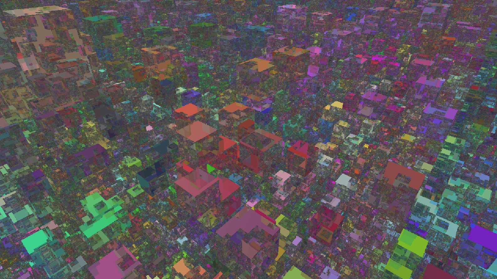

## Overview
**Date :** June 2023  
**Languages :** HLSL, C#  
**Libraries :**  Unity Compute Shaders  
**IDE :**  Unity Game Engine 2021.3.7f1, Visual Studio  
**Purpose :**  Hobby/Learning  
**Learning Sources :**  Sebastian Lague's Raytracing, Voxelbee Devlogs, DDA Algorithm  
**Time Spent :** ~14 days  

## Summary
This project is a voxel raymarcher with recursive reflections. It is written in HLSL and presented using the Unity game engine. To start, there is a Unity camera in the scene. Its transformation is modified with mouse and keyboard input using a C# script. A second script overwrites the camera's blit operation. Each time the screen is drawn, the user settings are updated (reflection count, world color, etc). A third script carries the voxels in memory 32-bit RGBA values, subdivided as chunks and copied into compute buffers. For demonstration purposes, there is a perlin noise function and a random-value setting when populating the voxel memory. All of the information in these scripts is passed into the shader as uniforms or buffers. The shader runs for each pixel of the screen, instantiating rays at the camera position. Perspective is applied to each ray based on the pixel's screen position. This simulates a camera frustrum. All rays are now calculated concurrently on the GPU. Each ray completes the following operations: 

1) Apply perspective using the screenspace UV coordinates associated with our pixel.
2) Geometrically calculate where this ray intersects with the global volume of chunks.
3) Step forward to the intersection with world bounds or return a mask if no intersection occurs.
4) Pass this valid ray position and direction into the Raymarch function.
5) The Raymarch function procedurally steps the ray position forward using the Digital Differential Analyzer algorithm (DDA).
6) Once a solid block (determined by the alpha channel) is hit, return the block's RGB value with a dot-product shadow applied.
7) The raymarch result is added to a running color sum. If reflections are off, the algorithm ends here with an opaque output.
8) If reflections are on and a hit was successful, the raymarch function is recursively called and its results are added to the color sum.
9) These recursive calls use the previous hit's data to instantiate a new ray at a reflected angle determined by the hit's normal.
10) The final color sum is applied to the corresponding screen-buffer pixel and returned for drawing.

The result is blazingly fast because the DDA algorithm is extremely efficient at traversing dense voxel space. DDA steps in block-wise space by hitting the next-closest axis, determined by the ray's direction. DDA only requires comparing the ratio between similar triangles. Once a block is hit, locating it in memory only takes O(1) time. This is because the block buffer is flattened into a 1d array. The buffer is organized by chunk strides in XYZ space, then their given blocks in XYZ space. This is similar to a z-order curve.

The final result is an algorithm that can render a complicated volume of 134,217,728 voxels with up to 10 reflections at a speed of 60-90 fps. 

## Takeaways
- Function parameters can become extremely complicated in HLSL if you do not abstract your variables
- DDA for voxels can introduce severe artifacts. Stepping in block-space prevents gaps forming at edges/corners
- Raymarching requires enormous video memory if you want O(n) block accesses
- Debugging visual glitches in a mature shader requires an intense and thorough process, often with creative color coding
- Instead of using HLSL to draft, plan out all of the expected behaviour on paper before writing code
- Reflections past 2-3 begin losing coherence and introducing noise. Refraction or blurring may solve this

## Video Montage

Footage of the completed application running various scenes:

▶️ [Demonstration <5:19>](https://youtu.be/oAfIFJsU2HM)

<!--
---

Compilation of the creation process with bloopers:

▶️ [Creation <>]([]))
-->

## Screenshots

This is the peak performance of the renderer. Each block's color is calculated in the noise function, overwritten as flat color, or determined by texture.


---

Here is a view from inside a ravine when the reflection count is slowly incremented.


---

Here are some example of recursive reflections. Two hills are repeatedly reflecting to one another, creating inception.


---

Using the results of the intersection math, we can easily calculate UV's and apply a texture to the world. In this case, wooden planks.


---

Transparent textures can be used to achieve a wireframe effect. This is still very performant since DDA raymarching is ideal for dense voxel scenes.


---

When viewing the edge of the world, you can see how the sky's colors are additively blended onto the ground.


---

This is the raw version of the random noise scene. There is no shading, only opaque, flat color.


---

This is the same scene but with dot product shadows.


---

This is after reflections are turned on to 1.


---

This is after reflections are turned up to 50. You can see the noise generated makes the scene incomprehensible.



---

If all blocks are colored with a black albedo, you can see only the cases where a ray reflects into the skybox.


---

Let's go back to the mountain scene. Up close, you can see reflections maintain crisp edges.


---

Viewing up from this ravine creates a stunning "rainbow sherbert" effect.


---

If we want a less psychedelic effect, applying a texture creates beautiful silhouettes.


## Code Highlights


Main Shader Kernel (ChunkTracer4.compute):

```hlsl
// MAIN KERNEL
[numthreads(8, 8, 1)]
void CSMain(uint3 id : SV_DispatchThreadID)
{
    // Get screenspace UV
    float xProgress = (id.x / ScreenResolutionX);
    float yProgress = (id.y / ScreenResolutionY);

    // Create a ray from base of eye
    float3 rayOrigin = CameraPosition;
    float3 rayDir = CameraForward;

    // Add perspective
    float aspectRatio = (ScreenResolutionX / ScreenResolutionY);
    rayDir += CameraRight * (xProgress - 0.5) * aspectRatio;
    rayDir += CameraUp * (yProgress - 0.5);

    // Try to advance our ray into the world bounds, and record whether it was successful
    bool hitBounds = ClampRayOriginToBounds(rayOrigin, rayDir);

    // Mask out all rays that never intersect the AABB of the chunks. Used for freecam/editor, but rarely in a game setting
    if (hitBounds == false) {
            Result[id.xy] = float4(0.0, 0, 1.0, 1);
            //Result[id.xy] =  skyColor*0.95; // mask color option
            //Result[id.xy] = skyColor; // mask color option
            return;
    }

    // Declare raymarching variables for recursive recording
    float3 hitPoint;
    float3 hitReflection;
    float4 hitColor;
    
    // Keep a running sum of the color
    float4 colorSum = float4(0.0, 0.0, 0.0, 0.0);
    // The larger the current reflection count, the less color is contributed to the color sum
    int reflectCount = 1;
    // Only becomes false when a ray hits the sky. Used to terminate the loop
    bool rayReflected = true;

    // The first shot will always hit a color, even if its the sky
    // This loop will run at least 1 time to achieve non-reflection cases
    while (rayReflected && reflectCount < MaxReflects + 2) {
        // Get a set of hit values and record whether this hit is a reflective surface (non-sky)
        rayReflected = RayMarch(rayOrigin, rayDir, hitPoint, hitReflection, hitColor);

        // For our first hit, the color will be opaque
        if (reflectCount == 1) {
            colorSum = hitColor;
        }
        // Following hits have a diminishing effect. Hit X has a contribution of 1/X
        else {
            colorSum += hitColor / reflectCount;
            // Multiply the total sum by (X / X+1) to normalize to 0-1 color space
            colorSum = colorSum * float(float(reflectCount) / (float(reflectCount) + 1));
        }

        // Update our origin ray values, thus freeing the hit parameters for any ensuing reflection
        rayOrigin = hitPoint;
        rayDir = hitReflection;
        // Keep track of which reflection will be calculated next
        reflectCount += 1;
    }

    // Apply our final pixel color value to the screen buffer. This will be applied to the Unity camera
    Result[id.xy] = colorSum;
}
```

Ray Marching Function (ChunkTracer4.compute):

```hlsl

// Continually step a blockposition using DDA until a block is hit, then return hit values including albedo/texture
bool RayMarch(float3 rayOrigin, float3 rayDir, out float3 hitPoint, out float3 hitReflection, out float4 hitColor) {

    // Worldpos represents a cartesian coordinate value
    int3 worldPos = floor(rayOrigin);
    // Chunkpos represents a chunkwise coordinate where 1 unit represents 1 chunk's width 
    int3 chunkPos;
    // Blockpos represents which local block coordinate the worldpos inhabits.
    // This will be in a range of (0, chunkSize-1) inclusive. This is required for flattened array indexing 
    int3 blockPos;

    // Limit iterations of raystepping to avoid infinite loops or impossibly large world traversal
    int steps = 0;
    while (steps < 2000) {
        steps++;
        
        // Advance the world position because it is in the same coordinate system as rayOrigin and Direction
        worldPos = DDA_OneUnit(rayOrigin, rayDir, worldPos);
        // Derive the chunkspace coordinate and blockspace coordinate for indexing arrays
        chunkPos = floor(worldPos / ChunkSize);
        blockPos = floor(worldPos) - chunkPos * ChunkSize;

        if (!PositionInBounds(worldPos)) {
            // Calculate the sky color for every ray - even reflections
            // This means the sky color itself can be carried through reflections
            hitColor = CalculateSkyColor(rayDir);
            return false;
        }

        // Sample our block memory to get an RGBA value!
        float4 blockColor = GetBlock(blockPos, chunkPos);

        // The alpha channel determines whether or not a block is solid
        if (blockColor.a > 0.5) {
            // Our calling script may want to overwrite block colors and textures
            if (OverwriteColor == 1) {
                blockColor = OverwriteValue;
            }

            // Simple dot product shadows can be applied depending on which planar normal we hit
            if (ShadowsOn == 1) {
                float shadow = 1;
                float3 uvNormal;
                float3 UVhit = FindEntryPoint(rayOrigin, rayDir, worldPos, uvNormal);

                // Use our UV intersection to sample a blocktexture
                if (BlockTextureOn) {
                    float2 UV;
                    // For horizontal faces
                    if (uvNormal.y == 0) {
                        // Y is always the vertical
                        UV.y = UVhit.y - worldPos.y;
                        // For z-faces, x is the cross product
                        if (uvNormal.z != 0)
                            UV.x = UVhit.x - worldPos.x;
                        // For x-faces, z is the cross product
                        else
                            UV.x = UVhit.z - worldPos.z;
                    }
                    else {
                        // for y-faces, use horizontals as UV
                        UV.x = UVhit.x - worldPos.x;
                        UV.y = UVhit.z - worldPos.z;
                    }
                    blockColor = BlockTexture.SampleLevel(samplerBlockTexture, UV * TextureDownscale, 0);
                    // If we hit a transparent pixel, loop to the next block as if we hit air!
                    // This works for clipping, but not for partial transparency
                    if (blockColor.a < 0.5) {
                        continue;
                    }
                }
                shadow = shadow * min(((dot(uvNormal, -float3(0, -1, -0.5)) + 1) / 2) + 0.1, 1);
                blockColor *= shadow;
            }
            
            // Update our output values for use in recursion
            float3 hitNormal;
            hitPoint = FindEntryPoint(rayOrigin, rayDir, worldPos, hitNormal);
            hitReflection = reflect(rayDir, hitNormal);
            
            hitColor = blockColor;
            // A hit was successful
            return true;
        }
    }
    // We hit the maximum raysteps without hitting the sky or a block
    // This means we had an infinite loop or the world was bigger than our safety max
    // To debug, return a very obvious yellow mask color
    hitColor = float4(1.0,1.0,0,0);
    // Do not reflect!
    return false;
}
```
